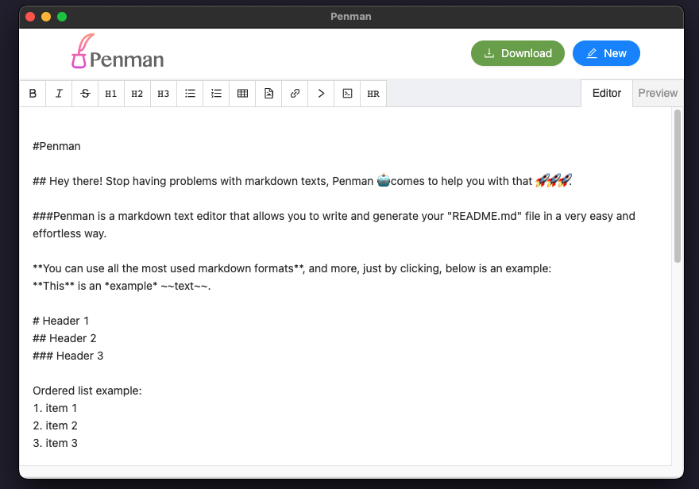
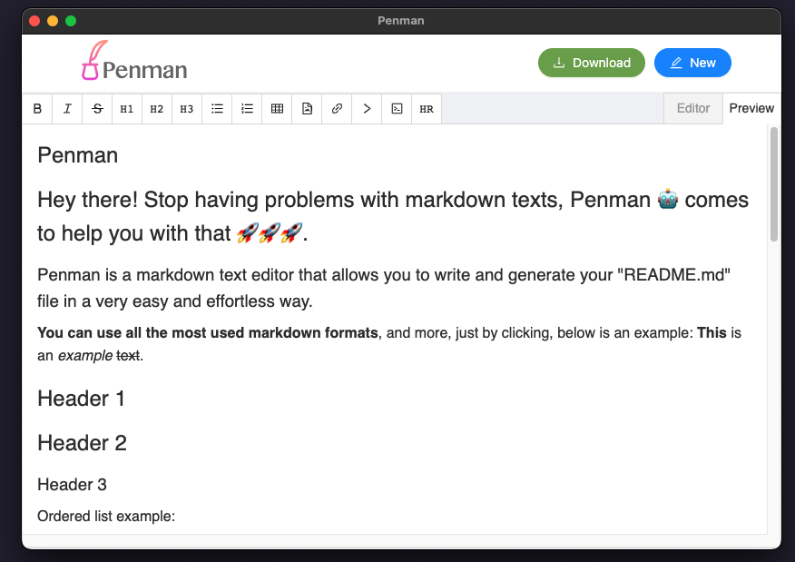

# Penman - GitHub Readme Previewer
Penman is a simple yet powerful tool that allows users to create and preview README files for their GitHub repositories. It provides a user-friendly graphical interface for easily creating and visualizing README content. Whether you're a seasoned developer or new to GitHub, Penman simplifies the process of documenting your projects and making them look more professional.


## Features
- **WYSIWYG Editor**: Penman provides a What-You-See-Is-What-You-Get (WYSIWYG) editor, making it easy to format and style your README content.
- **Markdown Support**: If you prefer working with Markdown, Penman supports it as well. You can switch between the WYSIWYG editor and the Markdown source code at any time.
- **Live Preview**: See how your README will look on GitHub in real-time. No need to push changes to your repository before previewing.
- **Syntax Highlighting**: Code blocks in your README will be automatically syntax-highlighted, making them more readable.
- **Custom Styles**: Customize the look of your README with your choice of fonts, colors, and styles.
- **Export and Save**: Save your README as a markdown file or HTML for later use, or directly commit it to your repository.

## Getting Started
To use Penman, you can visit the [Penman project on GitHub](https://github.com/dumildematos/penman) and download the latest release for your platform.

If you prefer to build Penman from the source code, follow these steps:

1. Clone the repository:
```bash
git clone https://github.com/dumildematos/penman.git
```
2. Navigate to the project directory:
```bash
cd penman
```
3. Install the project dependencies:
```bash
yarn
```
4. Start the application:
```bash
yarn start
```

## Contributing
We welcome contributions to Penman! If you'd like to contribute to the project, please follow these steps:

1. Fork the [Penman repository](https://github.com/dumildematos/penman) to your GitHub account.
2. Clone your fork to your local machine:
```bash
git clone https://github.com/your-username/penman.git
```
3. Create a new branch for your feature or bug fix:
```bash
git checkout -b feature/name
```
4. Make your changes and commit them:
```bash
git commit -m "Description of changes"
```
5. Push your changes to your GitHub fork:
```bash
git push origin feature-name
```
6. Create a Pull Request on the original Penman repository for review and inclusion.

## Screenshots

## editor



## previw



## License
This project is licensed under the MIT License - see the [LICENSE](https://github.com/dumildematos/penman/blob/master/LICENSE) file for details.

## Acknowledgments
Penman was created by Dumilde Matos using the [Electron React Boilerplate](https://electron-react-boilerplate.js.org). Special thanks to the open-source community for their valuable contributions.

------------

Feel free to use Penman to make your README creation process easier and more efficient. If you encounter any [issues](https://github.com/dumildematos/penman/issues) or have suggestions for improvements, please create an issue on GitHub. Your feedback is highly appreciated!
